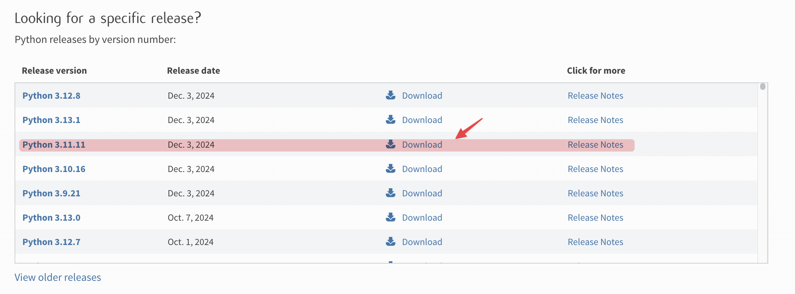

# 💻 Beginner's Guide: Install Homebrew, Git, and Python 3.11

This guide will walk you through installing **Homebrew**, **Git**, and **Python 3.11** on **Mac** and **Windows** in a simple, step-by-step way.

---

## 🖥️ macOS Installation Guide

### **1. Install Homebrew** (Mac only)
Homebrew is a package manager that makes it easy to install software.

1. Open **Terminal** (`Cmd + Space`, type **Terminal**, press **Enter**).
2. Install Homebrew by running:
   ```bash
   /bin/bash -c "$(curl -fsSL https://raw.githubusercontent.com/Homebrew/install/HEAD/install.sh)"
   ```
3. Verify installation:
   ```bash
   brew --version
   ```
   ✅ If you see a version number, Homebrew is installed!

---

### **2. Install Git**
Git is a version control system useful for coding and automation.

1. Run:
   ```bash
   brew install git
   ```
2. Verify installation:
   ```bash
   git --version
   ```
   ✅ You should see `git version 2.x.x`.

---

### **3. Install Python 3.11**



1. Install Python 3.11 with:
   ```bash
   brew install python@3.11
   ```
2. Check the installed version:
   ```bash
   python3 --version
   ```
   ✅ It should print **Python 3.11.x**.

---

### **4. Verify & Upgrade pip (Python's Package Manager)**
`pip` is used to install Python packages.

1. Ensure pip is installed:
   ```bash
   python3 -m ensurepip --default-pip
   ```
2. Upgrade pip to the latest version:
   ```bash
   python3 -m pip install --upgrade pip
   ```
3. Check the pip version:
   ```bash
   pip --version
   ```
   ✅ If you see `pip 23.x.x`, pip is ready to use!

---